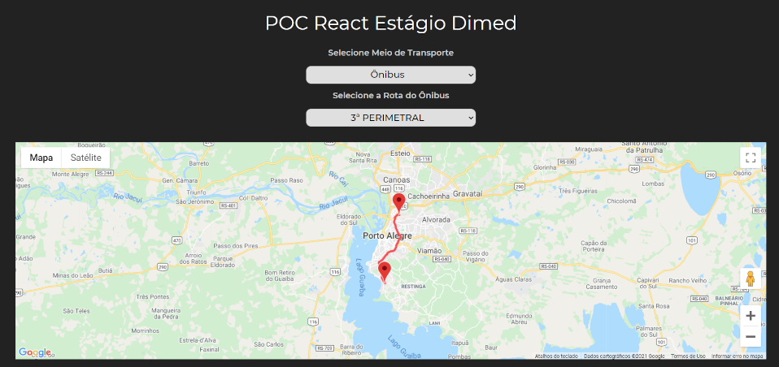

# Line Map React Application



## Installation

1. Download [Node](https://nodejs.org/pt-br/download/)

2. Clone project from github
````
git clone https://github.com/NcryScooby/POC.git
````
4. cd into project folder

6. Install local project package
````
npm install
````

## Run Project

Run `npm start` for a dev server. Navigate to `http://localhost:3000/`. The app will automatically reload if you change any of the source files.
